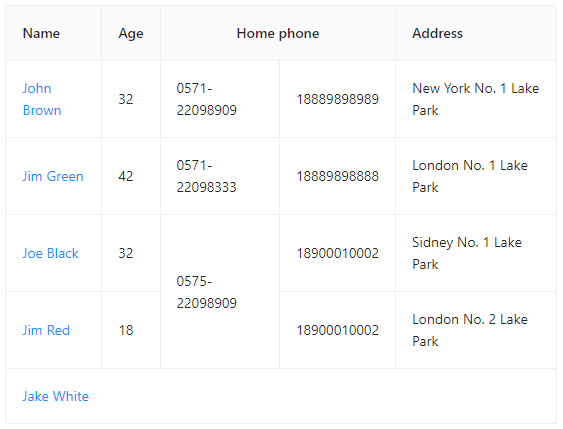
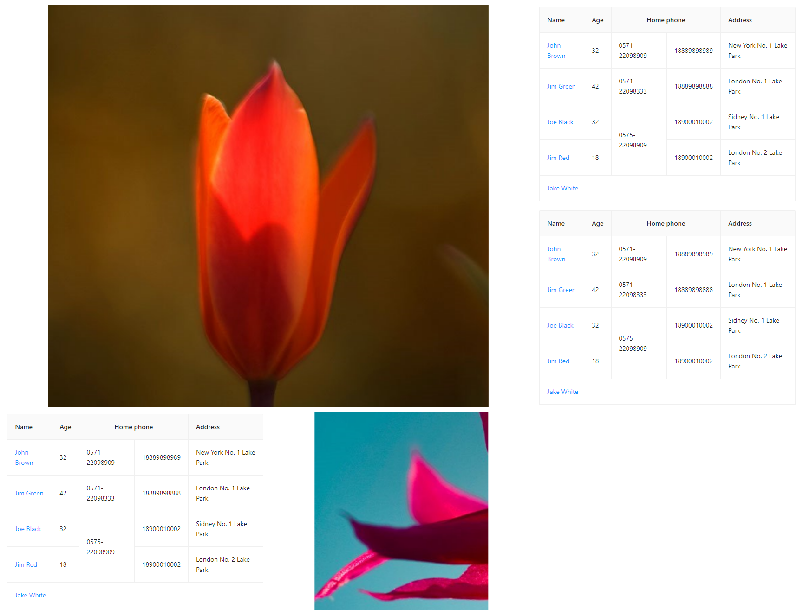

`Merge images on canvas,looks likes grid template!Can be used both of node and browser.`

## Install
- node (Must install [canvas](https://www.npmjs.com/package/canvas "canvas"))
`npm install canvas merge-images-grid` or `yarn add canvas merge-images-grid`

- browser
`npm install merge-images-grid` or `yarn add merge-images-grid`

## Usage
- node

| a.png | b.png(a table png) | c.png | 
| :----: | :----: | :----: | 
|  |  |  |

```js
import { Canvas } from 'canvas';
import CanvasGrid from 'merge-images-grid';
import pkg from 'canvas';
import fs from 'fs';
const { loadImage } = pkg;

const a = await loadImage('a.png');
const b = await loadImage('b.png');
const c = await loadImage('c.png');

const list = [
    {
        colSpan: 2,
        rowSpan: 2,
        image: a
    },
    {
        image: b,
    },
    {
        image: b,
    },
    {
        image: b,
    },
    {
        image: c
    }
]

const merge = new CanvasGrid({
    canvas: new Canvas(2, 2),
    bgColor: '#fff',
    list,
})
const buffer = merge.canvas.toBuffer();
fs.writeFileSync('demo.png', buffer);
```

result:demo.png


- browser
```js
import CanvasGrid from 'merge-images-grid';

const merge = new CanvasGrid({
    canvas: document.createElement('canvas'),
    ...     
});

document.body.appendChild(merge.canvas);
```

## Options

### CanvasGridProps

```js
export interface CanvasGridProps {
    /** Canvas | HTMLCanvasElement */
    canvas: Canvas | HTMLCanvasElement;
    /** canvas background color */
    bgColor?: string;
    /** cell width */
    width?: number;
    /** cell height */
    height?: number;
    /** grid's padding default 10 */
    padding?: number | number[];
    /** a way of alignment each box along the appropriate axis,like css 'align-items' */
    alignItems?: 'center' | 'start' | 'end';
    /** a way of justifying each box along the appropriate axis,like css 'justify-items' */
    justifyItems?: 'center' | 'start' | 'end';
    /** image list */
    list: ItemConfig[];
    /** gap between each cell,default 10 */
    gap?: number | [number, number];
    /** column number default 3 */
    col?: number;
    /** 
     * columns's width type,default 'max'
     * 
     * 'max': all columns's width will be the same(cell's max width).
     * 
     * 'min': each columns's width will be the max of columns's cell.
     * 
     * 'auto': if colSpan > 1 ,the cell colSpan columns's width will be the same.
     * 
     * 'fixed': if CanvasGridProps['width'] set,all columns's width will be CanvasGridProps['width'],else the same as 'max'.
     */
    widthType?: 'max' | 'min' | 'auto' | 'fixed';
    /** cell's height type,default 'auto' */
    heightType?: 'max' | 'min' | 'auto' | 'fixed';
    /** 
     * image draw type,like css 'object-fit' default:'contain'
     * 
     * 'auto': if image overflow the cell,will be the same as 'contain'
     */
    objectFit?: 'auto' | 'contain' | 'fill' | 'cover';
}

export type ItemConfig = {
    /** colSpan of this cell */
    colSpan?: number;
    /** rowSpan of this cell */
    rowSpan?: number;
    /** cell's image */
    image?: Image | Canvas;
} & Pick<CanvasGridProps, 'width' | 'height' | 'alignItems' | 'justifyItems' | 'objectFit'>
```